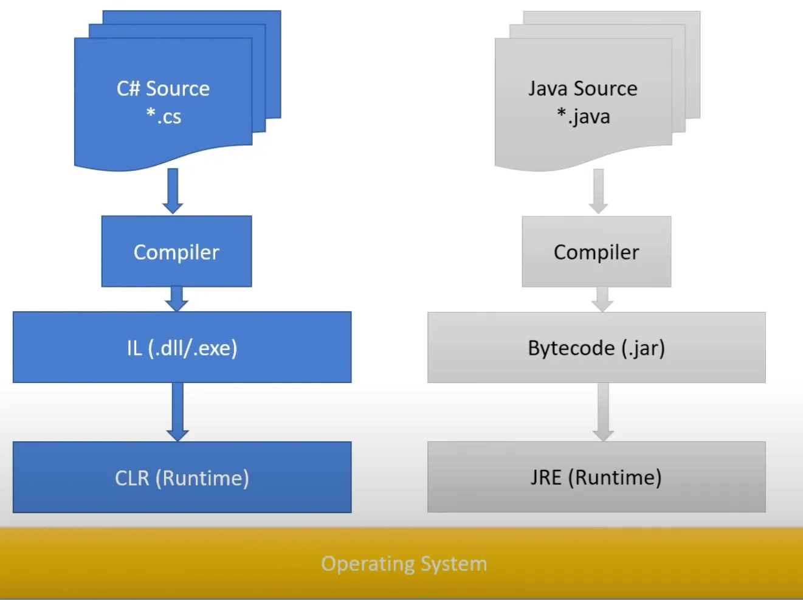

# C#



Can simplify Get/Set methods:

```csharp
using System // like import int Java
namespace MyPackage // like package .. in Java

List<int> intList; // Primitives are objects, So can be used like this
int? nullableNumber = 1; // Nullable value, instead of Optional<Integer>

bool exists = false; // boolean in Java
Calculate(ref exists) // we use 'ref' keyword both on using and parameter

public void Calculate(ref bool exists) {} // ref is effective pointer
if (s1 == s2) { ... } // == can be used to company any. Despite .equals() in Java
Console.WriteLine($"Name:{player.Name}, Age: {player.Age}"); // formatted string

class Player {
    public Player(String name, int age)
    {
        this.Name = name;
        this.Age = age;
    }
    public String Name { get; set; } // Simplified get/set methods
    public int Age { get; set; }
}

public static void Main(String[] args) {} // C# uses 'Main' instead of 'main'

int[] numbers = {1,2,3};
SwapNumbers(numbers);
// In C#, function can't modify the passed value.
// We should pass 'ref' to be able to edit
// But in Java objects (not primitives) are modifiable in function

fixed (int* listStart = &list[0]) // 
```

Things like `Length` , `Main`  and function names are uppercase in C#

C# has the following types specifiers alongside `class`, `interface` and `enum`:

- Struct
- Delegate
- Record
- Tuple

In Java, primitives are value types, and objects are reference types. In C# can define manually.

In C# we can define using struct values types, and using class reference types

Java:
```java
public interface Func<R,T> {
	public R function (T value);
}
```

C#:
```csharp
delegate Result Function<in T, out Result>(T input);
```


C# doesn’t have throw exceptions: `void doIt( ) throws Exception {}`

C# support LINQ (Language Integrated Query) which allows create any type of query against any kind of datasets.

Usage of actual pointers in C#:
```csharp
static unsafe void Sort(int[] list)
        {
            bool stillSwapping = true;
            fixed (int* listStart = &list[0]) // get pointer to first element in the list.
            // if we don't use fixed, the address of list may change later. so this listStart
            // will point to nowhere.
            {
                int* listEnd = listStart + list.Length - 1; // Because list items will be in sequence in memory
                while (stillSwapping)
                {
                    stillSwapping = false;
                    for (int* ptr = listStart; ptr < listEnd; ptr++)
                    {
                        int* nextPtr = ptr + 1;
                        if (*ptr > *nextPtr)
                        {
                            SwapValues(ptr, nextPtr);
                            stillSwapping = true;
                        }
                    }
                }
            }
        }
```